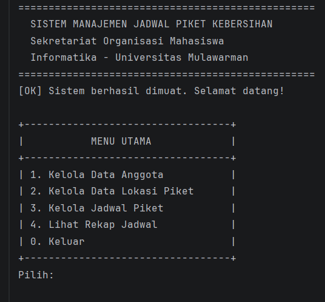
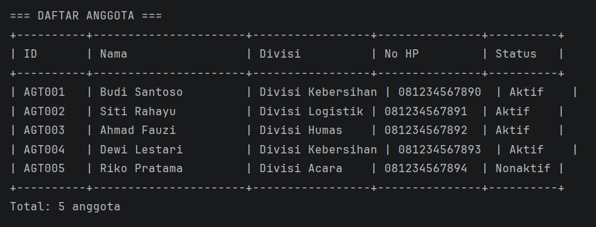
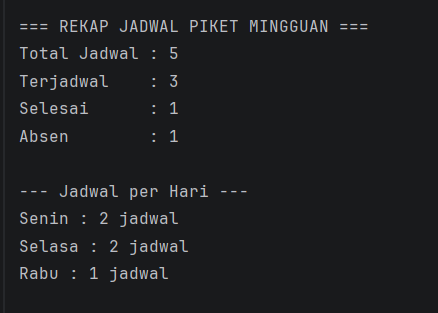

# Sistem Manajemen Jadwal Piket Kebersihan Sekretariat Organisasi

**Posttest 1 - Pemrograman Berorientasi Objek**  
Informatika - Universitas Mulawarman

---

## Identitas

| |                     |
|---|---------------------|
| Nama | [Fachlevi Muhammad] |
| NIM | [2409106059]        |
| Kelas | [B1 2024]           |

---

## Deskripsi

Program ini adalah aplikasi konsol untuk mengelola jadwal piket kebersihan di sekretariat organisasi mahasiswa. Dibuat menggunakan Java dengan konsep OOP.

Program memiliki fitur CRUD (Create, Read, Update, Delete) dan berjalan terus sampai user memilih keluar.

---

## Class yang Digunakan

Program ini menggunakan 3 class:

1. **Anggota** - menyimpan data anggota organisasi (nama, divisi, no hp, status aktif)
2. **LokasiPiket** - menyimpan data lokasi yang dibersihkan (nama lokasi, lantai, kapasitas)
3. **JadwalPiket** - menyimpan jadwal piket (anggota, lokasi, hari, jam, status)

---

## Konsep OOP yang Dipakai

- **Class & Object** - setiap data dimodelkan sebagai class, objek dibuat dengan `new`
- **Property** - setiap class punya atribut `private`
- **Constructor** - untuk memberi nilai awal saat objek dibuat
- **Method** - getter dan setter untuk mengakses property
- **Keyword `this`** - membedakan property dengan parameter
- **ArrayList** - menyimpan data secara dinamis

---

## Cara Menjalankan

1. Pastikan JDK sudah terinstall
2. Buka project di IntelliJ IDEA
3. Klik tombol Run pada file `Main.java`

---

## Screenshot

### Menu Utama

### Data Anggota

### Jadwal Piket
