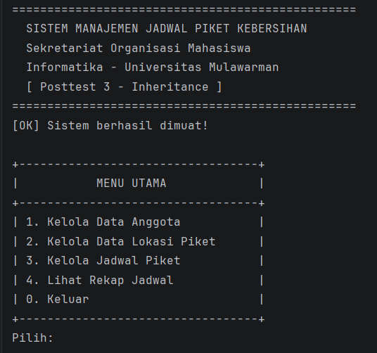
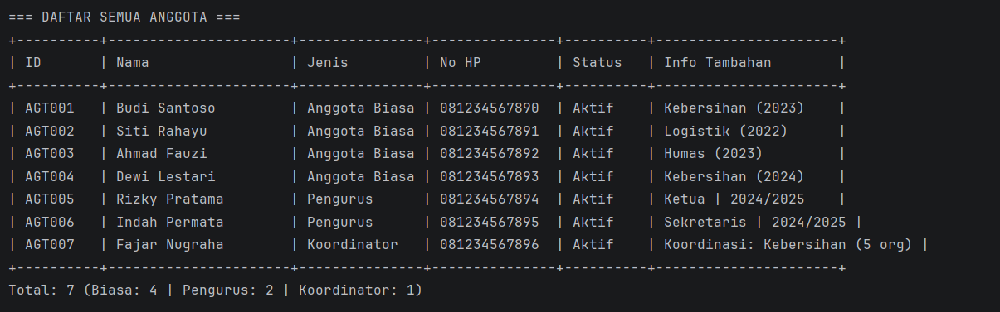
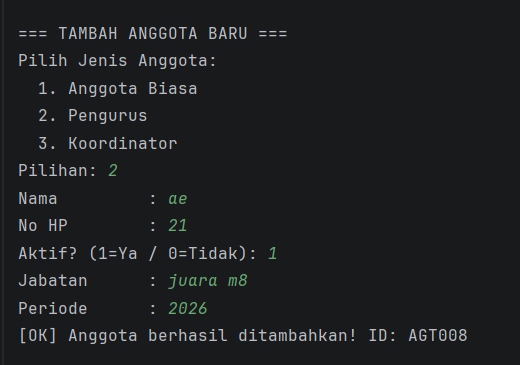

# Sistem Manajemen Jadwal Piket Kebersihan - Posttest 3

**Posttest 3 - Inheritance**  
Informatika - Universitas Mulawarman  
Laboratorium ASCii

---

## Identitas

| |                     |
|---|---------------------|
| Nama | [Fachlevi Muhammad] |
| NIM | [2409106059]        |
| Kelas | [B1 2024]           |

---

## Deskripsi

Melanjutkan project Posttest 2, program ini ditambahkan penerapan konsep **Inheritance** sesuai Modul 4. Program tetap mengelola jadwal piket kebersihan sekretariat organisasi dengan fitur CRUD lengkap.

---

## Konsep Inheritance yang Diterapkan

### Tipe Inheritance: Hierarchical Inheritance
Satu superclass (`Anggota`) diwarisi oleh **3 subclass** sekaligus.

```
           Anggota          ← Superclass / Parent Class
          /    |    \
         ↓     ↓     ↓
  AnggotaBiasa  Pengurus  Koordinator
  (Subclass 1) (Subclass 2) (Subclass 3 - Poin Plus!)
```

### Mengapa Logis?
Menggunakan relasi **is-a** sesuai modul:
- `AnggotaBiasa` **IS-AN** `Anggota` ✅
- `Pengurus` **IS-AN** `Anggota` ✅
- `Koordinator` **IS-AN** `Anggota` ✅

Ketiganya adalah anggota organisasi, namun memiliki peran yang berbeda.

---

## Penjelasan Class

### Superclass: `Anggota`
Berisi property dan method yang **dimiliki semua** jenis anggota.

| Property | Tipe | Keterangan |
|---|---|---|
| `idAnggota` | `String` | ID unik anggota |
| `nama` | `String` | Nama lengkap |
| `noHp` | `String` | Nomor HP |
| `aktif` | `boolean` | Status keaktifan |

Method yang bisa di-**override** oleh subclass:
- `getJenis()` → mengembalikan jenis anggota
- `getInfoTambahan()` → mengembalikan info khusus subclass

### Subclass 1: `AnggotaBiasa extends Anggota`
Mewarisi semua dari `Anggota`, ditambah:

| Property Tambahan | Tipe | Keterangan |
|---|---|---|
| `divisi` | `String` | Divisi dalam organisasi |
| `tahunMasuk` | `int` | Tahun bergabung |

### Subclass 2: `Pengurus extends Anggota`
Mewarisi semua dari `Anggota`, ditambah:

| Property Tambahan | Tipe | Keterangan |
|---|---|---|
| `jabatan` | `String` | Jabatan (Ketua, Sekretaris, dll) |
| `periode` | `String` | Masa menjabat |

### Subclass 3: `Koordinator extends Anggota` ⭐ Poin Plus
Mewarisi semua dari `Anggota`, ditambah:

| Property Tambahan | Tipe | Keterangan |
|---|---|---|
| `divisiKoordinasi` | `String` | Area yang dikoordinasi |
| `jumlahAnggota` | `int` | Jumlah anggota dibawahi |

---

## Keyword Inheritance yang Digunakan

### `extends`
Digunakan untuk membuat subclass mewarisi superclass.
```java
public class AnggotaBiasa extends Anggota { ... }
public class Pengurus extends Anggota { ... }
public class Koordinator extends Anggota { ... }
```

### `super()`
Digunakan subclass untuk memanggil constructor superclass.
```java
public AnggotaBiasa(String idAnggota, String nama, ...) {
    super(idAnggota, nama, noHp, aktif); // memanggil constructor Anggota
    this.divisi = divisi;
    this.tahunMasuk = tahunMasuk;
}
```

### Override Method
Subclass menimpa method superclass untuk perilaku yang berbeda.
```java
// Di Anggota (superclass):
public String getJenis() { return "Anggota"; }

// Di Pengurus (subclass) - di-override:
@Override
public String getJenis() { return "Pengurus"; }
```

---

## Struktur Project

```
posttest3/
├── README.md
├── pom.xml
└── src/main/java/id/my/piket/
    ├── model/
    │   ├── Anggota.java          ← SUPERCLASS (diubah)
    │   ├── AnggotaBiasa.java     ← SUBCLASS BARU
    │   ├── Pengurus.java         ← SUBCLASS BARU
    │   ├── Koordinator.java      ← SUBCLASS BARU (poin plus)
    │   ├── LokasiPiket.java
    │   └── JadwalPiket.java
    ├── manager/
    │   ├── BaseManager.java
    │   ├── Validator.java
    │   ├── AnggotaManager.java   ← diupdate (handle 3 subclass)
    │   ├── LokasiManager.java
    │   └── JadwalManager.java
    └── ui/
        └── Main.java
```

---

## Cara Menjalankan

### IntelliJ IDEA
1. Buka folder `posttest3`
2. Klik kanan `pom.xml` → **Add as Maven Project**
3. Buka `Main.java` → klik tombol ▶

---

## Screenshot

### Menu Utama


### Daftar Anggota (3 Jenis)


### Tambah Pengurus (Subclass)
