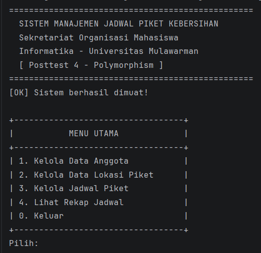
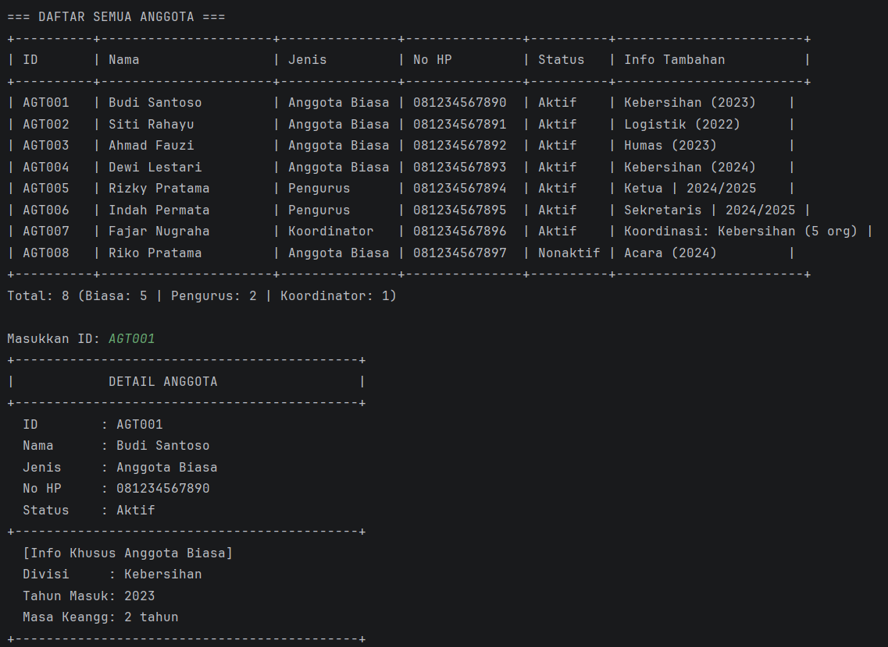
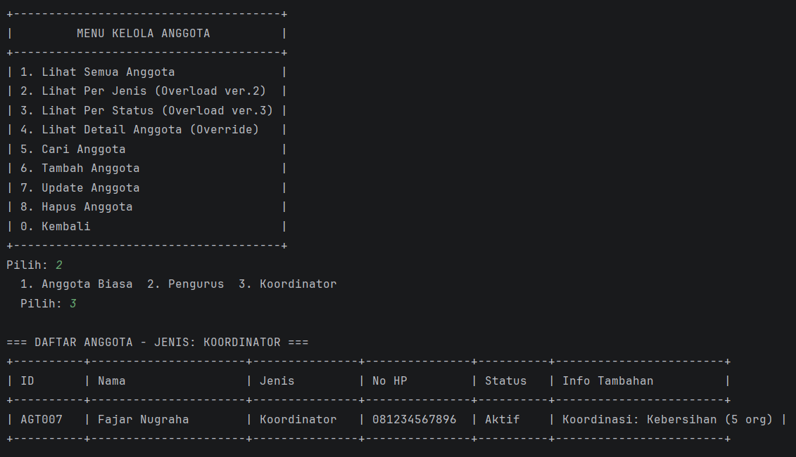

# Sistem Manajemen Jadwal Piket Kebersihan - Posttest 4

**Posttest 4 - Polymorphism**  
Informatika - Universitas Mulawarman

---

## Identitas

| |                     |
|---|---------------------|
| Nama | [Fachlevi Muhammad] |
| NIM | [2409106059]        |
| Kelas | [B1 2024]           |

---

## Deskripsi

Melanjutkan Posttest 3, program ini ditambahkan penerapan konsep **Polymorphism** sesuai Modul 5. Program tetap mengelola jadwal piket kebersihan sekretariat organisasi dengan fitur CRUD lengkap.

---

## Penerapan Polymorphism

### 1. Static Polymorphism — Method Overloading

Method **`tampilkanAnggota()`** di class `AnggotaManager` memiliki **3 versi** dengan nama sama tapi parameter berbeda:

```
tampilkanAnggota()              → tampil SEMUA anggota
tampilkanAnggota(String jenis)  → tampil berdasarkan JENIS
tampilkanAnggota(boolean aktif) → tampil berdasarkan STATUS
```

**Contoh kode:**
```java
// Versi 1 - tanpa parameter
public void tampilkanAnggota() { ... }

// Versi 2 - filter by jenis
public void tampilkanAnggota(String jenis) { ... }

// Versi 3 - filter by status aktif
public void tampilkanAnggota(boolean aktifSaja) { ... }
```

**Mengapa logis?**
Menampilkan daftar anggota adalah kebutuhan yang sering dilakukan dengan cara berbeda — kadang ingin lihat semua, kadang hanya pengurus, kadang hanya yang aktif. Menggunakan overloading menghindari penulisan nama method yang berbeda-beda.

---

### 2. Dynamic Polymorphism — Method Overriding

Method **`tampilDetail()`**, **`getJenis()`**, dan **`getInfoTambahan()`** di superclass `Anggota` di-override oleh setiap subclass dengan isi yang berbeda:

| Method | Anggota (super) | AnggotaBiasa | Pengurus | Koordinator |
|--------|----------------|--------------|----------|-------------|
| `getJenis()` | "Anggota" | "Anggota Biasa" | "Pengurus" | "Koordinator" |
| `getInfoTambahan()` | "-" | divisi + tahun | jabatan + periode | divisi koordinasi |
| `tampilDetail()` | info dasar | + divisi & tahun | + jabatan & periode | + divisi & jumlah anggota |

**Contoh kode:**
```java
// Di superclass Anggota:
public void tampilDetail() {
    System.out.println("DETAIL ANGGOTA");
    // hanya info dasar
}

// Di subclass Pengurus (Override):
@Override
public void tampilDetail() {
    System.out.println("DETAIL PENGURUS ORGANISASI");
    // info dasar + jabatan + periode
}
```

**Mengapa logis?**
Setiap jenis anggota perlu menampilkan detail yang berbeda. AnggotaBiasa perlu menampilkan divisi dan tahun masuk, Pengurus perlu menampilkan jabatan, Koordinator perlu menampilkan jumlah anggota yang dikoordinasi.

---

## Ringkasan Polymorphism

| Jenis | Tipe | Nama Method | Jumlah |
|-------|------|-------------|--------|
| Overloading (Static) | `AnggotaManager` | `tampilkanAnggota()` | 3 versi ⭐ Poin Plus |
| Overriding (Dynamic) | Semua subclass | `getJenis()` | 3 subclass |
| Overriding (Dynamic) | Semua subclass | `getInfoTambahan()` | 3 subclass |
| Overriding (Dynamic) | Semua subclass | `tampilDetail()` | 3 subclass ⭐ Poin Plus |

---

## Struktur Project

```
posttest4/
├── README.md
├── pom.xml
└── src/main/java/id/my/piket/
    ├── model/
    │   ├── Anggota.java          ← Superclass, method yang di-override
    │   ├── AnggotaBiasa.java     ← Override getJenis, getInfoTambahan, tampilDetail
    │   ├── Pengurus.java         ← Override getJenis, getInfoTambahan, tampilDetail
    │   ├── Koordinator.java      ← Override getJenis, getInfoTambahan, tampilDetail
    │   ├── LokasiPiket.java
    │   └── JadwalPiket.java
    ├── manager/
    │   ├── BaseManager.java
    │   ├── Validator.java
    │   ├── AnggotaManager.java   ← Method Overloading tampilkanAnggota() 3 versi
    │   ├── LokasiManager.java
    │   └── JadwalManager.java
    └── ui/
        └── Main.java
```

---

## Cara Menjalankan

1. Buka folder `posttest4` di IntelliJ IDEA
2. Klik kanan `pom.xml` → **Add as Maven Project**
3. Buka `Main.java` → klik tombol ▶

---

## Screenshot

### Menu Utama


### Overloading — Tampil Per Jenis


### Overriding — Detail Pengurus
