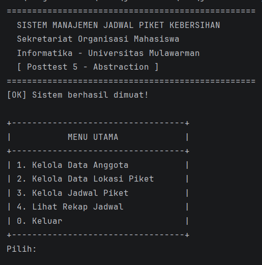
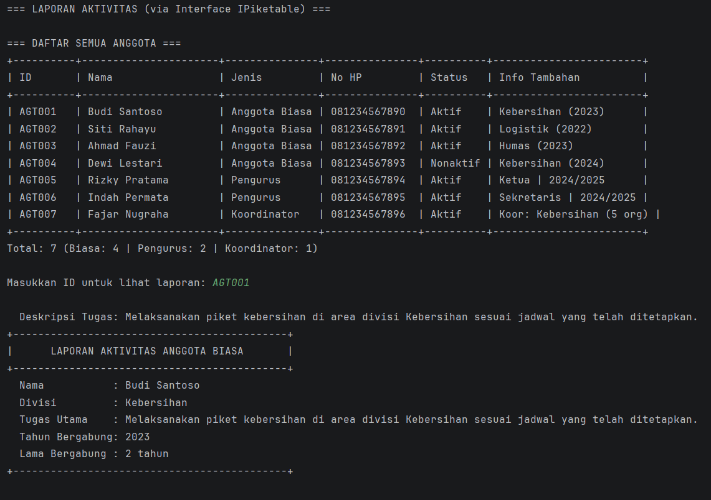
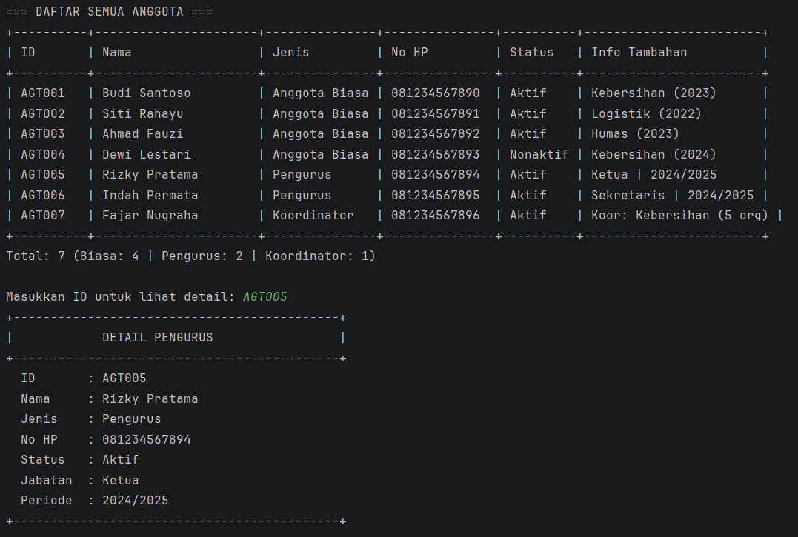

# Sistem Manajemen Jadwal Piket Kebersihan - Posttest 5

**Posttest 5 - Abstraction**  
Informatika - Universitas Mulawarman

---

## Identitas

| |                     |
|---|---------------------|
| Nama | [Fachlevi Muhammad] |
| NIM | [2409106059]        |
| Kelas | [B24]               |

---

## Deskripsi

Melanjutkan project Posttest 4, program ini menerapkan konsep **Abstraction** sesuai Modul 6. Perubahan utama: class `Anggota` diubah menjadi **Abstract Class**, dan dibuat **Interface `IPiketable`** yang diimplementasikan oleh semua subclass.

---

## Konsep Abstraction yang Diterapkan

### 1. Abstract Class — `Anggota`

Class `Anggota` diubah menjadi abstract class dengan menambahkan keyword `abstract`:

```java
public abstract class Anggota {
    // Abstract methods — tidak ada isi, subclass WAJIB mengisi!
    public abstract String getJenis();
    public abstract String getInfoTambahan();
    public abstract void tampilDetail();

    // Concrete methods — tetap ada isinya, diwarisi subclass
    public void setNama(String nama) { ... }
    public String getNama() { return nama; }
}
```

**Akibatnya:** `new Anggota()` → ERROR! Tidak bisa dibuat langsung.
Hanya bisa dibuat melalui subclass: `new AnggotaBiasa(...)`, `new Pengurus(...)`, dll.

### 2. Interface — `IPiketable`

Interface dengan 2 method yang wajib diimplementasikan:

```java
public interface IPiketable {
    String getDeskripsiTugas();    // Method 1
    void getLaporanAktivitas();    // Method 2
}
```

### 3. Implementasi di Subclass

Semua subclass menggunakan dua hal sekaligus:

```java
public class AnggotaBiasa extends Anggota implements IPiketable {
    // Wajib implement abstract methods dari Anggota:
    @Override public String getJenis() { return "Anggota Biasa"; }
    @Override public String getInfoTambahan() { ... }
    @Override public void tampilDetail() { ... }

    // Wajib implement methods dari interface IPiketable:
    @Override public String getDeskripsiTugas() { ... }
    @Override public void getLaporanAktivitas() { ... }
}
```

---

## Perbedaan Abstract Class vs Interface (sesuai modul)

| | Abstract Class (`Anggota`) | Interface (`IPiketable`) |
|---|---|---|
| Keyword | `abstract class` | `interface` |
| Constructor | ✅ Boleh | ❌ Tidak boleh |
| Method biasa | ✅ Boleh | ❌ Tidak boleh |
| Digunakan dengan | `extends` | `implements` |
| Tujuan | Template/hierarki | Kontrak/perjanjian |

---

## Struktur Project

```
posttest5/
├── README.md
├── pom.xml
└── src/main/java/id/my/piket/
    ├── model/
    │   ├── IPiketable.java      ← INTERFACE BARU (2 method)
    │   ├── Anggota.java         ← ABSTRACT CLASS (diubah dari posttest 4)
    │   ├── AnggotaBiasa.java    ← extends Anggota + implements IPiketable
    │   ├── Pengurus.java        ← extends Anggota + implements IPiketable
    │   ├── Koordinator.java     ← extends Anggota + implements IPiketable
    │   ├── LokasiPiket.java
    │   └── JadwalPiket.java
    ├── manager/
    │   ├── AnggotaManager.java  ← ada menu "Lihat Laporan" via IPiketable
    │   ├── BaseManager.java
    │   ├── Validator.java
    │   ├── LokasiManager.java
    │   └── JadwalManager.java
    └── ui/
        └── Main.java
```

---

## Cara Menjalankan

1. Buka folder `posttest5` di IntelliJ
2. Klik kanan `pom.xml` → **Add as Maven Project**
3. Klik tombol ▶

---

## Screenshot

### Menu Utama


### Laporan via Interface IPiketable


### Detail Anggota (Abstract Method)
