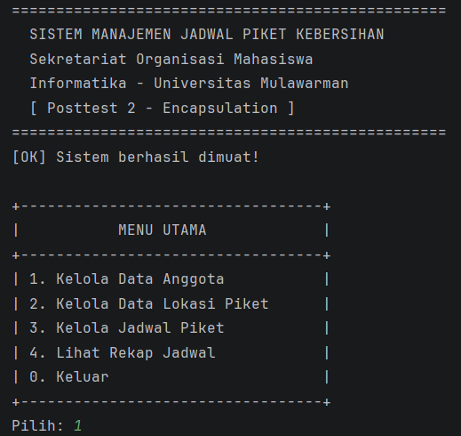
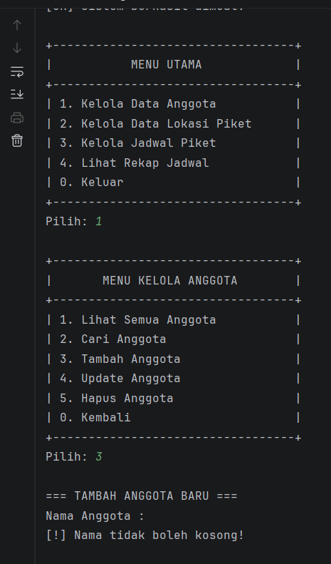
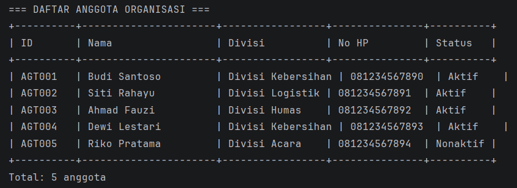

# Sistem Manajemen Jadwal Piket Kebersihan - Posttest 2

**Posttest 2 - Encapsulation**  
Informatika - Universitas Mulawarman

---

## Identitas

| |                   |
|---|-------------------|
| Nama | Fachlevi Muhammad |
| NIM | 2409106059        |
| Kelas | B1 2024           |

---

## Deskripsi

Melanjutkan project Posttest 1, program ini ditambahkan penerapan konsep **Encapsulation** sesuai Modul 3. Program tetap mengelola jadwal piket kebersihan sekretariat organisasi dengan fitur CRUD.

---

## Penerapan Encapsulation

Encapsulation diterapkan dengan menyembunyikan data (property `private`) dan hanya boleh diakses melalui getter/setter yang sudah diberi validasi.

**Contoh — tanpa encapsulation (SALAH):**
```java
anggota.nama = ""; // Bisa diisi kosong! Tidak ada validasi
```

**Contoh — dengan encapsulation (BENAR):**
```java
anggota.setNama(""); // Otomatis dicegah, ada validasi di dalam setter
```

---

## Penerapan Access Modifier (Semua 4 Jenis)

### 1. `private` — di semua class model
Property tidak bisa diakses langsung dari luar class.
```java
// Anggota.java
private String nama;
private String divisi;
private boolean aktif;
```

### 2. `public` — getter & setter dengan validasi
Satu-satunya cara untuk membaca/mengubah data dari luar.
```java
// Anggota.java
public void setNama(String nama) {
    if (nama == null || nama.trim().isEmpty()) {
        System.out.println("[!] Nama tidak boleh kosong.");
    } else {
        this.nama = nama.trim();
    }
}
```

### 3. `protected` — di BaseManager.java
Method helper yang hanya bisa dipakai oleh class dalam package yang sama.
```java
// BaseManager.java
protected static void cetakJudul(String judul) { ... }
protected static void cetakOK(String pesan) { ... }
protected static void cetakError(String pesan) { ... }
```
Dipakai oleh `AnggotaManager`, `LokasiManager`, `JadwalManager` karena berada di package yang sama (`id.my.piket.manager`).

### 4. `default` (package-private) — di Validator.java
Class tanpa modifier, hanya bisa diakses dari dalam package yang sama.
```java
// Validator.java — tidak ada "public" di depan class!
class Validator {
    static boolean isNotEmpty(String value) { ... }
    static boolean isValidJam(String jam) { ... }
}
```

---

## File Baru yang Ditambahkan

| File | Keterangan |
|------|------------|
| `BaseManager.java` | Class dengan method `protected` sebagai helper semua Manager |
| `Validator.java` | Class `default` (package-private) untuk validasi input |
| `pom.xml` | Konfigurasi Maven (build tool) |


---

## Cara Menjalankan

### Menggunakan Maven (Direkomendasikan)
```bash
cd posttest2
mvn compile
mvn exec:java
```

### Menggunakan IntelliJ IDEA
1. Buka folder `posttest2` di IntelliJ
2. Klik kanan `pom.xml` → **Add as Maven Project**
3. Buka `Main.java` → klik tombol ▶

---

## Screenshot

### Menu Utama


### Validasi Encapsulation (setter menolak input kosong)


### Data Anggota
